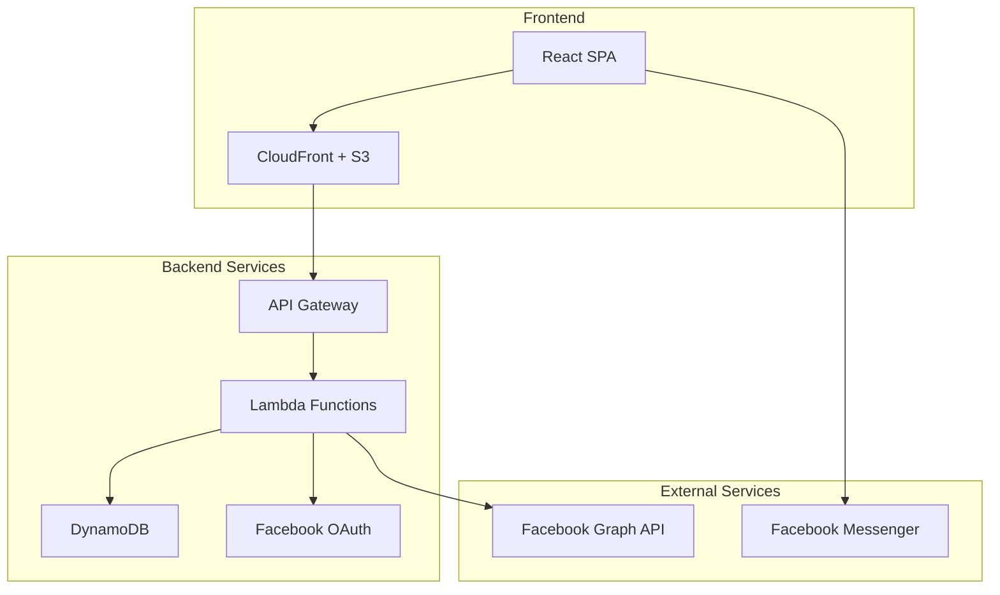

# Design Document

## Overview

The Thadingyut Festival Pocket Money platform is a serverless web application built on AWS infrastructure that facilitates festive money-sharing through secure giveaway URLs. The system uses Facebook OAuth for authentication, implements fair random distribution algorithms, and provides a mobile-first experience with Myanmar cultural theming.

## Architecture

### High-Level Architecture



### Technology Stack

- **Frontend**: React.js with responsive design, hosted on S3 + CloudFront
- **Backend**: Node.js Lambda functions with API Gateway
- **Database**: DynamoDB for scalable NoSQL storage
- **Authentication**: Facebook OAuth 2.0
- **Infrastructure**: AWS serverless architecture
- **CI/CD**: GitHub Actions for automated deployment

## Components and Interfaces

### Frontend Components

#### 1. Authentication Component
- **Purpose**: Handle Facebook OAuth flow
- **Key Features**:
  - Facebook SDK integration
  - Session management
  - Redirect handling after authentication
- **State Management**: User authentication status, profile data

#### 2. Giveaway Creation Component
- **Purpose**: Allow givers to create new giveaways
- **Key Features**:
  - Form validation for budget and receiver count
  - Payment method selection (Wave, kPay, AyaPay, a+ Wallet, CB Pay)
  - URL generation and sharing
- **Validation Rules**:
  - Budget must be positive number
  - Receiver count must be integer > 1
  - At least one payment method required

#### 3. Giveaway Participation Component
- **Purpose**: Handle receiver participation in giveaways
- **Key Features**:
  - URL hash validation
  - Random portion calculation display
  - Social sharing integration
  - Duplicate participation prevention

#### 4. Dashboard Component
- **Purpose**: Display giveaway results to givers
- **Key Features**:
  - Receiver list with portions
  - Facebook Messenger integration
  - Distribution summary
  - Payment tracking

#### 5. Theme Provider
- **Purpose**: Apply Thadingyut Festival theming
- **Key Features**:
  - Cultural color palette (gold, red, traditional Myanmar colors)
  - Festival imagery and icons
  - Responsive typography
  - Mobile-first CSS framework

### Backend API Endpoints

#### Authentication Endpoints
- `POST /auth/facebook` - Exchange Facebook token for JWT
- `GET /auth/verify` - Verify JWT token validity
- `POST /auth/refresh` - Refresh expired tokens

#### Giveaway Management Endpoints
- `POST /giveaways` - Create new giveaway
- `GET /giveaways/{hash}` - Get giveaway by hash
- `POST /giveaways/{hash}/participate` - Participate in giveaway
- `GET /giveaways/{hash}/dashboard` - Get giveaway dashboard (giver only)

#### User Management Endpoints
- `GET /users/profile` - Get user profile
- `PUT /users/profile` - Update user profile

## Data Models

### User Model
```typescript
interface User {
  id: string;                    // Facebook user ID
  facebookId: string;           // Facebook user ID
  name: string;                 // Display name
  email?: string;               // Email (optional)
  profilePicture?: string;      // Profile image URL
  createdAt: Date;              // Account creation timestamp
  lastLoginAt: Date;            // Last login timestamp
}
```

### Giveaway Model
```typescript
interface Giveaway {
  id: string;                   // Unique giveaway ID
  hash: string;                 // Short hash for URL
  giverId: string;              // Creator's user ID
  budget: number;               // Total budget amount
  receiverCount: number;        // Maximum receivers
  paymentMethods: PaymentMethod[]; // Supported payment methods
  status: 'active' | 'completed' | 'expired';
  createdAt: Date;
  expiresAt?: Date;
  participants: Participant[];   // List of participants
  totalDistributed: number;     // Sum of all portions
}
```

### Participant Model
```typescript
interface Participant {
  userId: string;               // Receiver's user ID
  userName: string;             // Display name
  portion: number;              // Money amount received
  participatedAt: Date;         // Participation timestamp
  messengerLink: string;        // Facebook Messenger URL
}
```

### Payment Method Enum
```typescript
enum PaymentMethod {
  WAVE = 'wave',
  KPAY = 'kpay',
  AYAPAY = 'ayapay',
  A_PLUS_WALLET = 'a_plus_wallet',
  CB_PAY = 'cb_pay'
}
```

## Error Handling

### Frontend Error Handling
- **Network Errors**: Display user-friendly messages with retry options
- **Authentication Errors**: Redirect to login with clear error messages
- **Validation Errors**: Real-time form validation with inline error display
- **404 Errors**: Custom 404 page for invalid giveaway URLs

### Backend Error Handling
- **Authentication Errors**: Return 401 with clear error codes
- **Validation Errors**: Return 400 with detailed field-level errors
- **Not Found Errors**: Return 404 for invalid resources
- **Server Errors**: Return 500 with generic error message, log details
- **Rate Limiting**: Implement throttling for API endpoints

### Error Response Format
```typescript
interface ErrorResponse {
  error: {
    code: string;
    message: string;
    details?: any;
  };
  timestamp: string;
  requestId: string;
}
```

## Testing Strategy

### Unit Testing
- **Frontend**: Jest + React Testing Library for component testing
- **Backend**: Jest for Lambda function testing
- **Coverage Target**: 80% code coverage minimum

### Integration Testing
- **API Testing**: Supertest for endpoint testing
- **Database Testing**: DynamoDB Local for integration tests
- **Authentication Testing**: Mock Facebook OAuth responses

### End-to-End Testing
- **User Flows**: Cypress for critical user journeys
- **Cross-browser Testing**: Test on mobile Safari, Chrome, Firefox
- **Performance Testing**: Lighthouse CI for performance metrics

### Test Scenarios
1. **Complete Giveaway Flow**: Create → Share → Participate → Dashboard
2. **Authentication Flow**: Login → Logout → Session management
3. **Edge Cases**: Invalid URLs, duplicate participation, budget exhaustion
4. **Mobile Responsiveness**: Touch interactions, viewport scaling
5. **Random Distribution**: Verify fair distribution and budget accuracy

## Security Considerations

### Authentication Security
- JWT tokens with short expiration (1 hour)
- Refresh token rotation
- Facebook token validation on each request

### URL Security
- Cryptographically secure hash generation
- Hash length sufficient to prevent brute force (8+ characters)
- Rate limiting on giveaway access attempts

### Data Protection
- Input sanitization and validation
- SQL injection prevention (NoSQL injection for DynamoDB)
- XSS protection with Content Security Policy

### Infrastructure Security
- API Gateway throttling and request validation
- Lambda function least-privilege IAM roles
- DynamoDB encryption at rest and in transit
- CloudFront security headers

## Performance Optimization

### Frontend Performance
- Code splitting for route-based chunks
- Image optimization and lazy loading
- Service worker for offline capability
- Bundle size optimization with tree shaking

### Backend Performance
- Lambda cold start optimization
- DynamoDB query optimization with proper indexing
- API Gateway caching for static responses
- Connection pooling for external API calls

### Caching Strategy
- CloudFront caching for static assets (1 year)
- API Gateway caching for giveaway data (5 minutes)
- Browser caching for user profile data
- DynamoDB DAX for hot data access

## Deployment Architecture

### Environment Strategy
- **Development**: Local development with DynamoDB Local
- **Staging**: Full AWS stack with separate resources
- **Production**: Production AWS stack with monitoring

### Infrastructure as Code
- AWS CDK for infrastructure definition
- Separate stacks for different environments
- Automated rollback capabilities

### Monitoring and Logging
- CloudWatch for Lambda function monitoring
- X-Ray for distributed tracing
- Custom metrics for business logic (giveaway completion rates)
- Error alerting via SNS